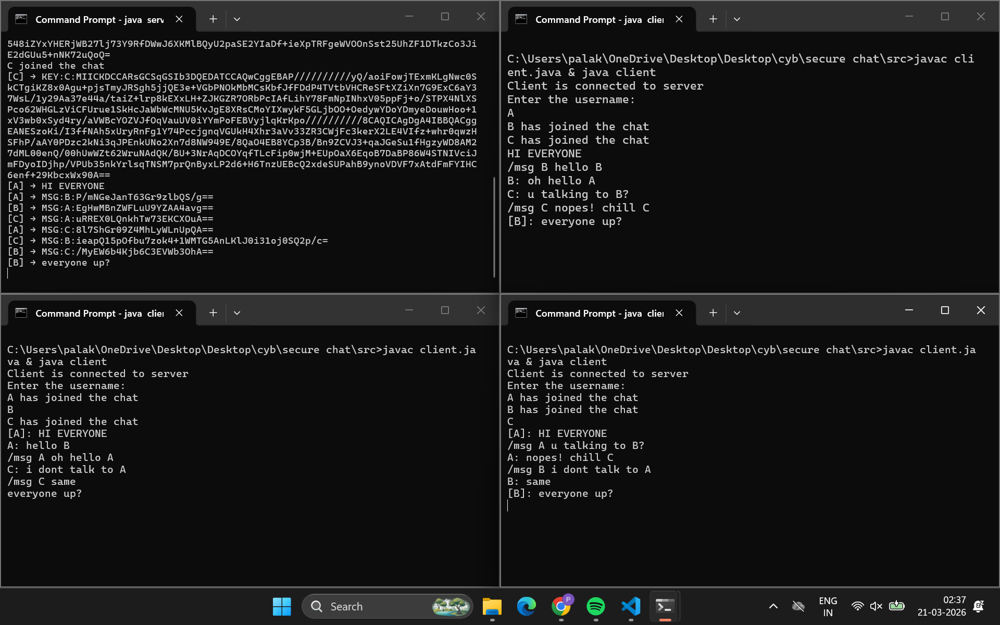

## 🔐 Phase 4: AES Encryption Layer

### 🚀 Overview

In this phase, the system was upgraded from plain-text communication to **encrypted messaging using AES**, built on top of the Diffie-Hellman key exchange from previous phases.

Each client now securely communicates using **per-user symmetric keys**.

---

### 🧠 Key Concept

* Diffie-Hellman generates a **shared secret**
* Shared secret is converted into an **AES key**
* Messages are encrypted before sending and decrypted on receipt

---

### 🔐 Encryption Model

* Each client maintains:

  ```java
  Map<String, SecretKey> sharedKeys;
  ```

* Communication is **pairwise encrypted**:

  ```text
  A → B uses key_AB  
  A → C uses key_AC
  ```

---

### ⚙️ Message Flow

```text
User Input (/msg B hello)
        ↓
Encrypt using AES key_AB
        ↓
Send → MSG:B:<encrypted>
        ↓
Server routes message
        ↓
Receiver decrypts using key_AB
```

---

### 📡 Message Protocol

```text
/msg <username> <message>
```

Internal format:

```text
MSG:<receiver>:<encrypted_message>
```

---

### SAMPLE


---

### 🎯 Features Added

✔️ End-to-end encrypted messaging (basic)
✔️ Per-user secure communication channels
✔️ Dynamic message routing via server
✔️ Command-based messaging system (`/msg`)

---

### ⚠️ Limitations

* Uses default AES mode (ECB) ❌
* No integrity/authentication ❌
* Not secure for production use

---

### 📌 Summary

This phase transforms the system from:

* ❌ Plain-text communication
* ✅ Encrypted, per-user secure messaging system

---

### 🔜 Next Phase

Upgrade to **AES-GCM** for:

* Authentication
* Integrity
* Production-level security
