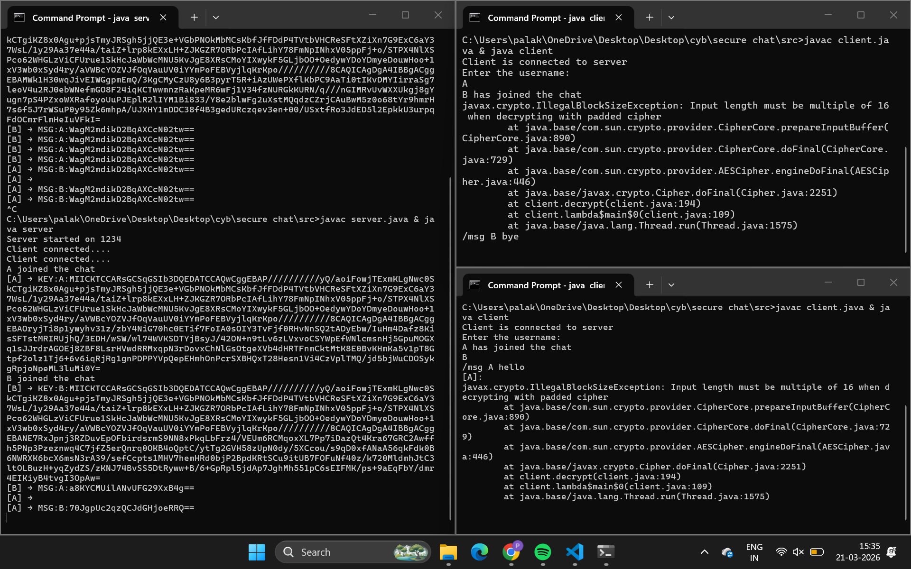

## 🔐 Phase 4: AES Encryption Layer

### 🚀 Overview

In this phase, the system was upgraded from plain-text communication to **encrypted messaging using AES**, built on top of the Diffie-Hellman key exchange from previous phases.

Each client now securely communicates using **per-user symmetric keys**.

---

### 🧠 Key Concept

* Diffie-Hellman generates a **shared secret**
* Shared secret is converted into an **AES key**
* Messages are encrypted before sending and decrypted on receipt

---

### 🔐 Encryption Model

* Each client maintains:

  ```java
  Map<String, SecretKey> sharedKeys;
  ```

* Communication is **pairwise encrypted**:

  ```text
  A → B uses key_AB  
  A → C uses key_AC
  ```

---

### ⚙️ Message Flow

```text
User Input (/msg B hello)
        ↓
Encrypt using AES key_AB
        ↓
Send → MSG:B:<encrypted>
        ↓
Server routes message
        ↓
Receiver decrypts using key_AB
```

---

### 📡 Message Protocol

```text
/msg <username> <message>
```

Internal format:

```text
MSG:<receiver>:<encrypted_message>
```

---

### SAMPLE


---

### 🎯 Features Added

✔️ End-to-end encrypted messaging (basic)
✔️ Per-user secure communication channels
✔️ Dynamic message routing via server
✔️ Command-based messaging system (`/msg`)

---

### ⚠️ Limitations

* Uses default AES mode (ECB) ❌
* No integrity/authentication ❌
* Not secure for production use

---

### 📌 Summary

This phase transforms the system from:

* ❌ Plain-text communication
* ✅ Encrypted, per-user secure messaging system

---

### 🔜 Next Phase

Upgrade to **AES-GCM** for:

* Authentication
* Integrity
* Production-level security
## 🔐 Phase 4: AES Encryption Layer

### 🚀 Overview

In this phase, the system was upgraded from plain-text communication to **encrypted messaging using AES**, built on top of the Diffie-Hellman key exchange from previous phases.

Each client now securely communicates using **per-user symmetric keys**.

---

### 🧠 Key Concept

* Diffie-Hellman generates a **shared secret**
* Shared secret is converted into an **AES key**
* Messages are encrypted before sending and decrypted on receipt

---

### 🔐 Encryption Model

* Each client maintains:

  ```java
  Map<String, SecretKey> sharedKeys;
  ```

* Communication is **pairwise encrypted**:

  ```text
  A → B uses key_AB  
  A → C uses key_AC
  ```

---

### ⚙️ Message Flow

```text
User Input (/msg B hello)
        ↓
Encrypt using AES key_AB
        ↓
Send → MSG:B:<encrypted>
        ↓
Server routes message
        ↓
Receiver decrypts using key_AB
```

---

### 📡 Message Protocol

```text
/msg <username> <message>
```

Internal format:

```text
MSG:<receiver>:<encrypted_message>
```

---

### SAMPLE


---

### 🎯 Features Added

✔️ End-to-end encrypted messaging (basic)
✔️ Per-user secure communication channels
✔️ Dynamic message routing via server
✔️ Command-based messaging system (`/msg`)

---


## ⚠️ Phase 4A: Cipher Mode Vulnerability Demonstration (AES-ECB)

### 🚀 Overview

Before upgrading to a secure encryption mode, this phase demonstrates the **practical weaknesses of AES in ECB mode** by simulating real attack scenarios.

The goal is to **break the system intentionally** and understand *why stronger encryption (AES-GCM) is required*.

---

### 🧠 Why This Matters

AES (in ECB mode) provides only basic confidentiality but fails to ensure:

* Data integrity
* Message authenticity
* Resistance to pattern leakage

This makes it unsuitable for real-world secure communication systems.

---

## ⚔️ Attack 1: Pattern Leakage

### 🔍 Concept

In ECB mode:

```text
Same plaintext → Same ciphertext
```

This allows attackers to identify repeating patterns in communication.

---

### 🧪 Simulation

Send identical messages multiple times:

```text
/msg B AAAAAAA
/msg B AAAAAAA
/msg B AAAAAAA
```

---

### 👀 Observation (Server Logs)

```text
MSG:B:XyZ123==
MSG:B:XyZ123==
MSG:B:XyZ123==
```

---

### 🎯 Insight

* Encryption is deterministic ❌
* Patterns are exposed ❌
* Not semantically secure ❌

---

## ⚔️ Attack 2: Ciphertext Tampering (MITM Simulation)

### 🔍 Concept

An attacker modifies encrypted data during transmission.

Since ECB mode has **no integrity verification**, the receiver cannot detect if the message was altered.

---

### ⚙️ Attack Implementation (Server-side Modification)

Modify the server to simulate an attacker intercepting and altering ciphertext.

---

### 🔧 Code Change (server.java)

Locate this block inside the server loop:

```java
if(message.startsWith("MSG:")){
```

Replace with:

```java
if(message.startsWith("MSG:")){

    String[] parts = message.split(":",3);
    String receiver = parts[1];
    String encrypted = parts[2];

    // ⚠️ ATTACK: Modify ciphertext
    if(encrypted.length() > 4){
        encrypted = encrypted.substring(0, encrypted.length()-2) + "AA";
    }

    synchronized(clients){
        for(ClientHandler client : clients){
            if(client.username.equals(receiver)){
                client.sendMessage("MSG:" + username + ":" + encrypted);
                break;
            }
        }
    }
    continue;
}
```

---

### 🧪 Test

```text
/msg B hello
```

---

### 👀 Result

At receiver:

* Decryption error OR ❌
* Garbage output ❌



---

### 🎯 Insight

* No integrity protection ❌
* No tamper detection ❌
* No authentication ❌

---

### 📌 Key Takeaways

ECB mode fails to provide:

* Secure encryption guarantees
* Message integrity
* Protection against active attackers

---
### ⚠️ Limitations

* Uses default AES mode (ECB) ❌
* No integrity/authentication ❌
* Not secure for production use

---