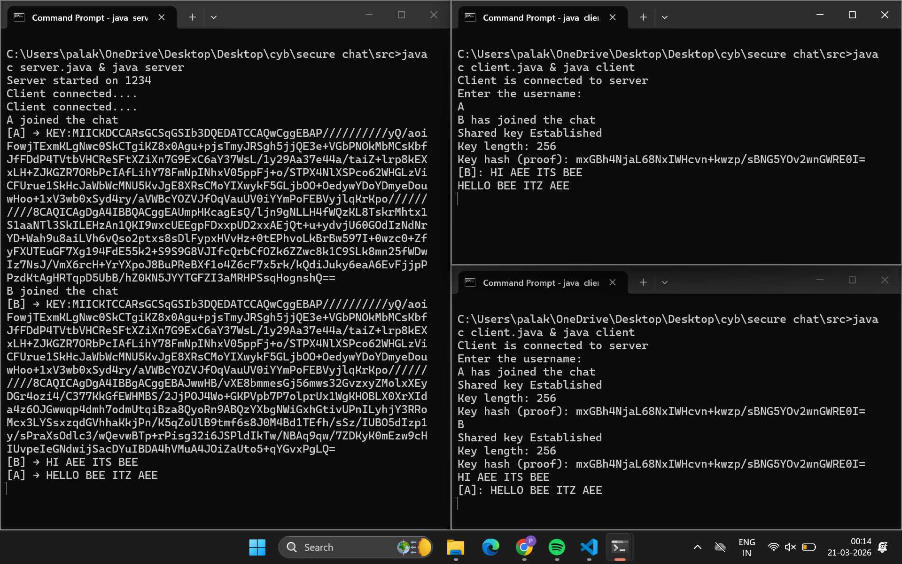
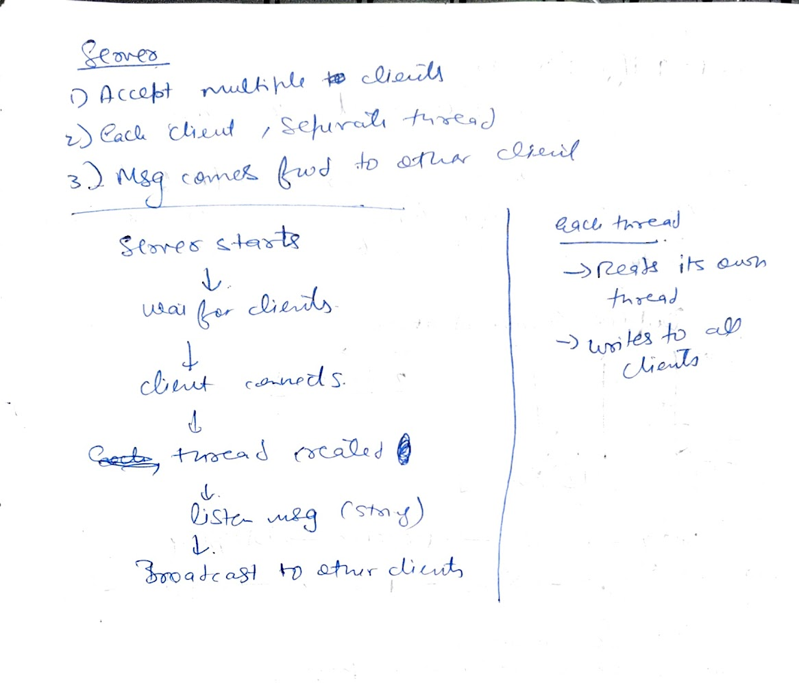
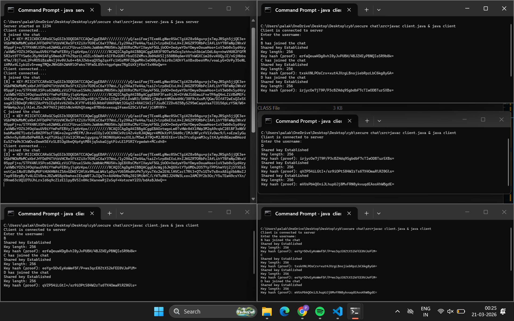
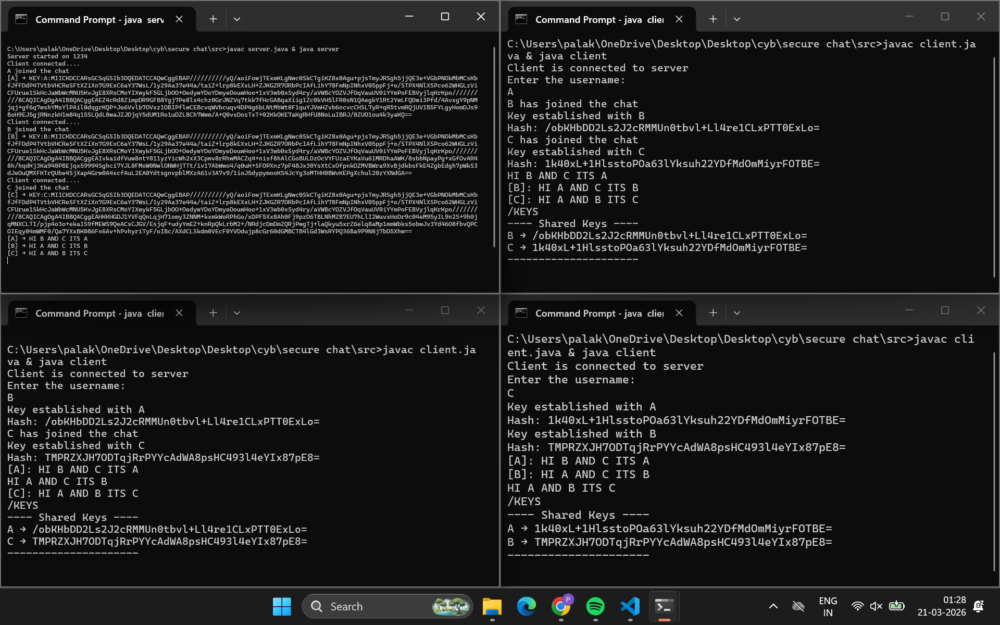

# 🔁 PHASE 3: Multi-Client Handling

This section explains how the system behaves as multiple clients join the chat and how key exchange is handled.

---

## 🧩 Core Idea

* Each client runs on a separate thread.
* The server maintains a shared list of all active clients.
* Messages (including public keys) are broadcast to all other clients.
* Diffie-Hellman key exchange happens **between every pair of clients**.

---

## 👥 Case 1: Two Clients (A, B)

### Flow:

1. A joins → sends `KEY_A`
2. B joins → sends `KEY_B`
3. Server relays:

   * `KEY_B` → A
   * `KEY_A` → B

### Result:

* A computes `key_AB`
* B computes `key_AB`

✅ Both share the same secret key


---

## 👥 Case 2: Three Clients (A, B, C)

### Flow:

1. A ↔ B already connected (key_AB exists)
2. C joins → sends `KEY_C`
3. Server relays:

   * `KEY_C` → A, B
   * `KEY_A`, `KEY_B` → C

### Result:

* A computes `key_AC`
* B computes `key_BC`
* C computes:

  * `key_CA`
  * `key_CB`

⚠️ Each pair has a **different shared key**


---

## 👥 Case 3: Four Clients (A, B, C, D)

### Flow:

1. A, B, C already connected
2. D joins → sends `KEY_D`
3. Server relays:

   * `KEY_D` → A, B, C
   * `KEY_A`, `KEY_B`, `KEY_C` → D

### Result:

* New keys formed:

  * A ↔ D → `key_AD`
  * B ↔ D → `key_BD`
  * C ↔ D → `key_CD`

  

---

## ⚠️ Current Limitation

At present, each client stores only **one shared key**:

```java
byte[] sharedSecret=ka.generateSecret();
```

### Impact:

* When a new client joins, the previous key gets overwritten
* Only the **latest connection's key is retained**

---

## 🧠 Key Insight

* Diffie-Hellman works **per connection (pair-wise)**
* In multi-client systems:

  * Total keys grow as connections increase
  * Proper handling requires storing keys per client

---

## 🚀 Next Improvement

To fully support multi-client encryption:

```java
Map<String, SecretKey> sharedKeys;
```

This allows:

* One key per client pair
* Correct encryption/decryption across all users

---
## 📌 🔄 Progress Update: Multi-Client Key Management

### 🚀 What’s New

In this phase, the system was extended to support **secure communication between multiple clients simultaneously** using Diffie-Hellman.

Instead of maintaining a single shared key, the client now maintains a **map of shared keys per user**:

```java
Map<String, byte[]> sharedKeys;
```

---

### 🧠 Why This Change Was Needed

Earlier:

* Only one shared key was handled ❌
* Not scalable beyond 2 clients ❌

Now:

* Each client maintains **independent keys with every other client** ✅
* Enables true **multi-client secure communication** ✅

---

### 🔐 How It Works

* When a new client joins:

  * Public keys are exchanged via server
* For every incoming public key:

  * A **new shared secret** is generated
* The key is stored as:

```text
Username → Shared Secret Key
```

Example:

```text
B → key_AB
C → key_AC
D → key_AD
```

---

### 🎯 Problem Solved

✔️ Supports **N clients dynamically**
✔️ Enables **pairwise secure channels**
✔️ Forms the base for **per-user encryption (AES in next phase)**

---

### ⚙️ Thread Safety (Important Improvement)

Since:

* One thread **writes keys** (receiver thread)
* Another thread **reads keys** (sender thread)

We introduced a thread-safe structure:

```java
Map<String, byte[]> sharedKeys = new ConcurrentHashMap<>();
```

---

### 🧩 Why Thread Safety Matters

Without synchronization:

* Race conditions ⚠️
* Inconsistent data ⚠️
* Random runtime errors ⚠️

With `ConcurrentHashMap`:

* Safe concurrent read/write ✅
* No manual synchronization needed ✅
* Cleaner and more reliable implementation ✅

---

### 🧪 Debug Feature Added

A local command was introduced:

```text
/keys
```

This prints all active shared keys (hashed for readability):

```text
---- Shared Keys ----
B → <hash>
C → <hash>
---------------------
```


---

### 📌 Summary

This phase transforms the system from:

* ❌ Single key
* ✅ Multi-client, scalable, and secure key architecture
